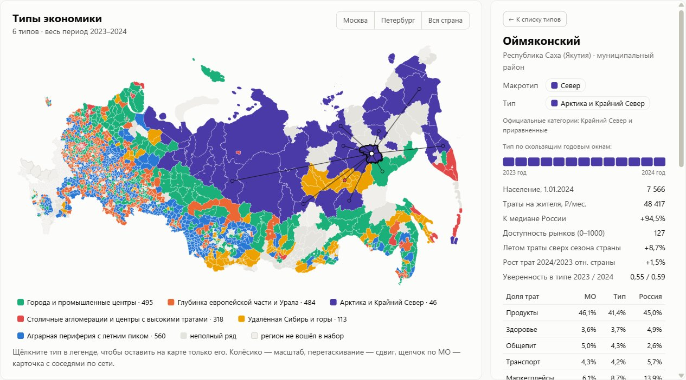

# Типы локальных экономик России по тратам жителей

Решение трека «Кластеризация» онлайн-конкурса СберИндекса 2026: **динамическая атрибутированная сеть
2 016 муниципалитетов** по безналичным расходам жителей (январь 2023 — декабрь 2024), её кластеризация
и интерпретация кластеров как реальных типов локальных экономик.

[](https://lebedev-git.github.io/sberindex-mo-clusters/)

* **Интерактивный лендинг** — **https://lebedev-git.github.io/sberindex-mo-clusters/** (исходники в `site/`): карта России, 4/6 типов, 13 временных срезов, карточка каждого МО с соседями по сети, переходы 2023→2024, карта компромиссов 45 конфигураций методов, устойчивость к настройкам, три разобранных примера.
* **Методологический отчёт** — [`docs/report.md`](docs/report.md) (PDF: [`docs/report.pdf`](docs/report.pdf)); обзор международного опыта — [`docs/international_review.md`](docs/international_review.md).
* **Все гиперпараметры** — [`configs/default.yaml`](configs/default.yaml); результаты всех сравнений — [`results/`](results/).

## Результат в пяти строках

* 2 016 муниципалитетов → **4 макротипа** (Столичные агломерации, Города, Сельская Россия, Север) → **6 типов**; вложенность уровней 92,7% («Удалённая Сибирь и горы» — переходный тип между «Городами», «Севером» и «Сельской Россией»).
* Метод — **KEFRiN** для сетей с признаками на сети синхронности трат; выбран правилом Коупленда по 45 конфигурациям и 7 индексам, детальный уровень — тот же метод при наименьшем устойчивом k ≥ 6 (`results/selection.json`, `results/selection_sensitivity.csv`).
* Типы совпадают с **официальными категориями**, которых модель не видела: «Арктика и Крайний Север» — 100% районов Крайнего Севера; типы объясняют 43% разброса численности населения и 40% — доступности рынков.
* Из 656 формальных смен типа 2023→2024 **значимы 116**; главный сдвиг — у 84 сельских районов исчез летний подъём трат, прежде всего в общепите (обратно 23, p ≈ 2·10⁻⁹).
* Проверка на США: траты не повторяют производственную типологию (ARI 0,03) — это **самостоятельная потребительская оптика**.

## Что сделано

| Шаг | Решение |
|---|---|
| Узлы и признаки | 2 016 МО с полными рядами; уровень трат, лог-профиль пяти категорий (CLR), сезонность сверх общероссийской — всё относительно медианы страны в том же месяце |
| Рёбра | 5 правил: евклид по признакам, корреляция идиосинкратических рядов, косинус корзины трат, DTW с окном лага, автодороги; основное — синхронность трат (корреляция) |
| Методы | k-means, Ward, спектральный, Leiden, KEFRiN (Shalileh & Mirkin, 2022) — на одних узлах, признаках и сети, k = 4…12 |
| Качество | SW, CH, S_Dbw, MQ (модулярность), AVI, AVU, ANUI по определениям статьи Shalileh, Antonov, Tsyplakova (2025) + устойчивость (бутстреп) + сравнение со случайным разбиением |
| Выбор | Правило Коупленда (7 индексов «голосуют» за 45 конфигураций) выбирает метод и макроуровень; детальный уровень — тот же метод при наименьшем k ≥ 6 с устойчивостью ARI ≥ 0,75; доля сети в KEFRiN — наибольшая, при которой силуэт теряет не больше 0,005 |
| Динамика | 13 скользящих годовых окон (шаг месяц); каждый снимок — своя сеть; KEFRiN с якорным стартом от основных типов; значимый переход = уверенная принадлежность в непересекающихся 2023 и 2024 |
| Интерпретация | Профили в рублях и долях, правило Миркина (отклонение типа от среднего), медоиды; внешняя проверка официальными метками Росстата (население, моногорода, Крайний Север, Арктика, агломерации) и доступностью рынков — модель их не видела |
| Обоснование | Что меняет сеть против k-means (136 МО, доля синхронных связей 35% → 57%); устойчивость к числу соседей, правилу рёбер и весам блоков; веса блоков — равные доли разброса (31/36/33%); типы против официального вида МО (сильнее по 5 метрикам из 7) — `results/justification.json`, `results/weights_sensitivity.csv` |
| Международный контекст | Обзор типологий США, Канады, ЕС/ОЭСР, Австралии, Бразилии; проверка на США: кластеры трат против официальных типов ERS (`scripts/us_check.py`) |

## Запуск

```bash
python -m venv .venv
.venv/Scripts/pip install -r requirements.txt        # Windows; в Linux/macOS: .venv/bin/pip
.venv/Scripts/python scripts/download_data.py        # данные СберИндекса -> data/raw/ (проверка SHA-256)
.venv/Scripts/python run.py --config configs/default.yaml
python -m http.server 8000 --directory site          # лендинг: http://localhost:8000
```

`run.py --fast` пропускает бутстреп устойчивости (≈3 мин вместо ≈12 мин); правило выбора проверяется только в полном режиме.
`python scripts/us_check.py` — проверка на данных США (≈1 мин). Самотест индексов: `python src/smc/metrics.py`. Python 3.12.

Лендинг публикуется на GitHub Pages через `.github/workflows/pages.yml` (один раз: Settings → Pages → Source: GitHub Actions).
Сервер `www.sberbank.com` подписан сертификатом Минцифры; `download_data.py` берёт корневой сертификат
с Госуслуг, сверяет отпечаток SHA-256 и не отключает проверку TLS.

## Структура

```
configs/default.yaml      гиперпараметры (признаки, окна, сети, методы, выбор)
configs/type_names.yaml   названия типов, привязанные к якорным МО (устойчиво к перенумерации)
run.py                    весь конвейер одной командой
src/smc/data.py           загрузка панели и справочника
src/smc/features.py       признаки узлов и ряды для рёбер
src/smc/graphs.py         5 правил рёбер, диагностика сетей
src/smc/clustering.py     5 методов, включая KEFRiN
src/smc/metrics.py        ICVI (SW, CH, S_Dbw, AVI, AVU, ANUI, MQ), устойчивость, внешняя проверка; самотест
src/smc/dynamics.py       эволюционная кластеризация окон, значимые переходы
src/smc/interpret.py      профили типов, правило Миркина, медоиды
src/smc/external.py       внешняя проверка официальными метками
src/smc/export_web.py     данные для лендинга
scripts/download_data.py  скачивание и проверка исходных данных
scripts/us_check.py       проверка на США (Opportunity Insights + USDA ERS)
data/external/            официальные российские метки МО (Росстат 2024 и др.) с описанием источников
results/                  таблицы всех сравнений и итогов (CSV/JSON)
site/                     статический лендинг (D3 v7, без сервера и внешних CDN)
docs/report.md            методологический отчёт
docs/international_review.md  обзор международного опыта и источников
scripts/build_report_pdf.py   сборка docs/report.pdf (pip install markdown; Edge или Chrome)
```

## Данные и лицензия

Данные СберИндекса: «Потребительские безналичные расходы на уровне муниципальных образований по категориям трат»,
«Индекс доступности рынков на уровне муниципальных образований», «Автодорожные и железнодорожные связи между
муниципальными образованиями». СберИндекс. https://sberindex.ru/ru/research/data-sense-opisanie-nabora-dannikh-khakatona-sberindeksa-po-munitsipalnim-dannim
(данные скачаны 08.10.2026). Лицензия CC BY-SA 4.0; производные данные в `site/data/` и `results/` распространяются
на тех же условиях. Исходные файлы в репозиторий не включены — их скачивает `scripts/download_data.py`.

Код — MIT. D3 — ISC (`site/vendor/d3.LICENSE`).

При разработке использовались ИИ-ассистенты (Claude).
